<!DOCTYPE html>
<HTML>
<HEAD>
	<META charset="UTF-8">
</HEAD>
<BODY>

<H2 id="contents">Study10 README Contents</H2>
<H3>Research mathematics and statistics</H3>

Java source code: 
 
 package 
	<a href="https://github.com/ee-eng-cs/Study10/tree/master/src/main/java/kp/">kp</a> 

Action: 
 
 1. Launch application with <I>"01 MVN exec.bat"</I> 

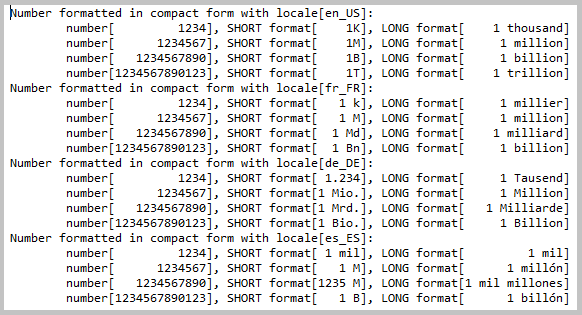 
<I>Console log from 'NumberInCompactForm.format()' method.</I>

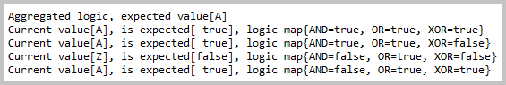 
<I>Console log from 'Logic.aggregate()' method.</I>

 
<I>Console log from 'EvenAndOddNumbers.segregate()' method.</I>

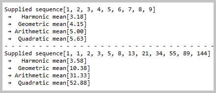 
<I>Console log from 'Means.computeMeansWithTeeing()' method.</I>

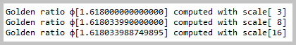 
<I>Console log from 'GoldenRatio.compute()' method.</I>

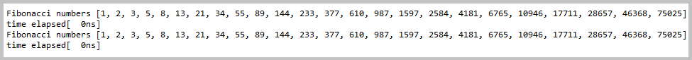 
<I>Console log from 'FibonacciNumbers.compute()' method.</I>

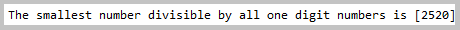 
<I>Console log from 'LeastCommonMultiple.compute()' method.</I>

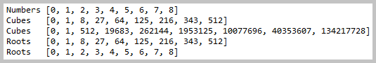 
<I>Console log from 'CubesAndRoots.compute()' method.</I>

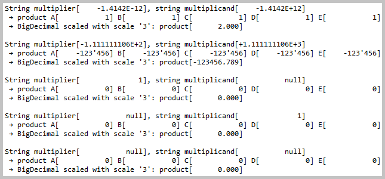 
<I>Console log from 'BigDecimalsFromStringRepresentation.multiply()' method.</I>

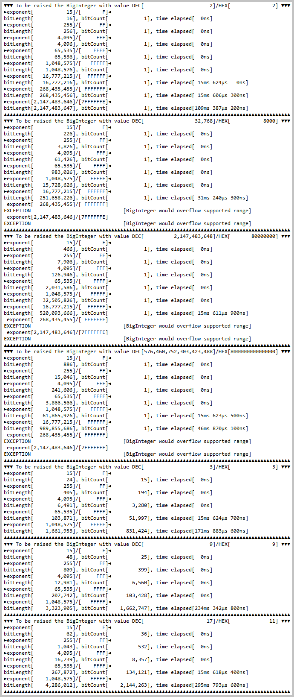 
<I>Console log from 'VeryBigIntegerRaised.compute()' method.</I>

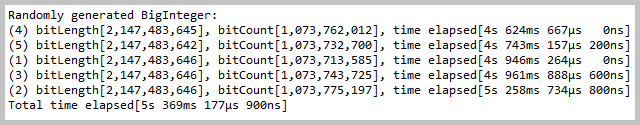 
<I>Console log from 'VeryBigIntegerRandomlyGenerated.compute()' method.</I>

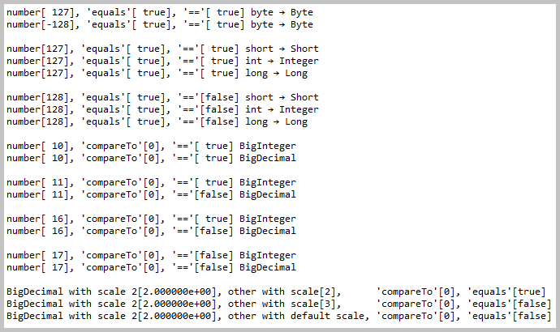 
<I>Console log from 'CachedNumbers.compare()' method.</I>

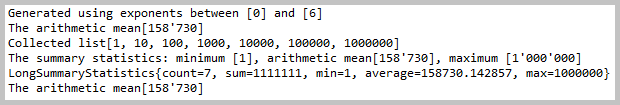 
<I>Console log from 'SummaryStatistics.show()' method.</I>

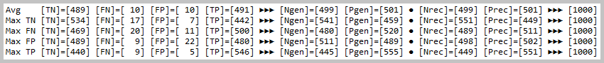 
<I>Console log from 'RandomizedTrialsLauncher.launchSeriesOfTrials(0)' method.</I>

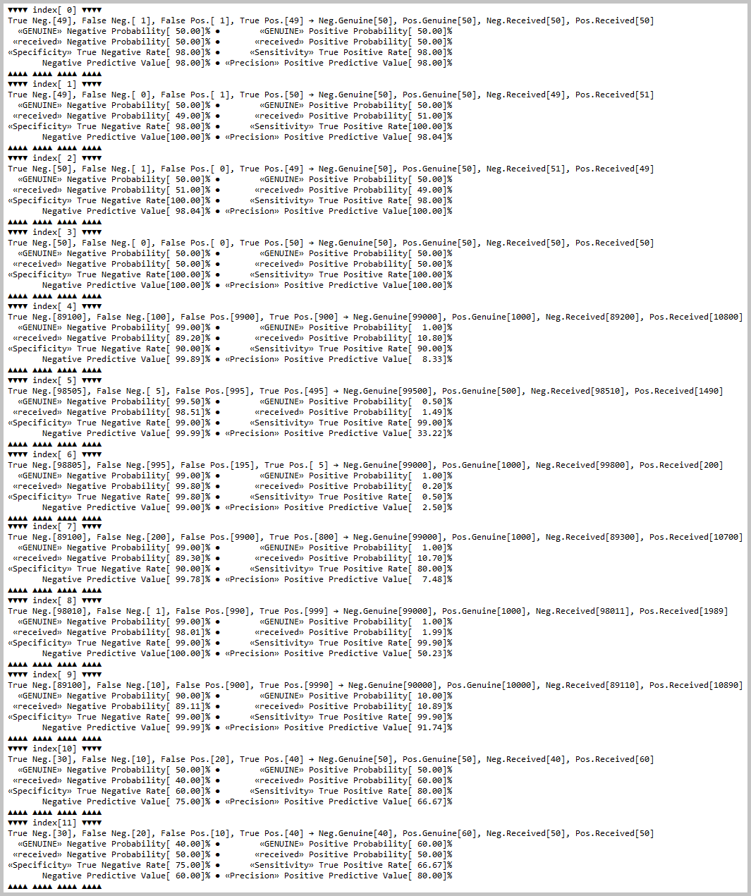 
<I>Console log from 'StatisticalMeasures.measureSamples()' method.</I>

<A href="apidocs/index.html?overview-summary.html" >API Specifications</A>
(API was not commited to <B>GitHub</B>; this link should be active after local build with <I>'mvn javadoc'</I>)

</BODY>
</HTML>